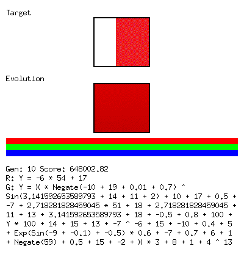
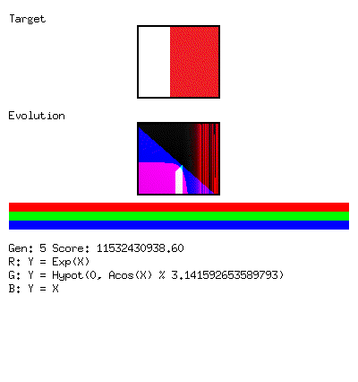
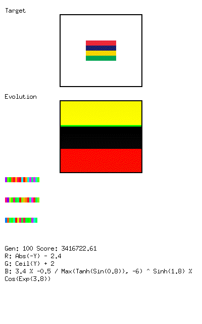
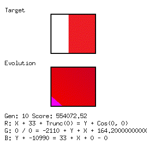

# Image Formula Find

This project uses a Genetic Algorithm to find mathematical formulas that generate an image approximating a target image. The formulas are evolved over generations to minimize the difference between the generated image and the target image.

## How it works

The "DNA" of an individual in the population consists of encoded strings representing mathematical formulas for the Red, Green, and Blue color channels. These formulas are parsed and evaluated for each pixel (X, Y) to determine the color.

The evolution process involves:
1.  **Selection**: The best performing formulas (closest to target) are selected.
2.  **Crossover**: DNA from parents is combined to create children.
3.  **Mutation**: DNA is randomly mutated (insertions, deletions, shifts, etc.).

## DNA Representations

The project supports multiple DNA representations, which define how the genetic string is translated into a mathematical formula.

### DNA1 (Recursive Expression)

The original representation (`dna1`) uses a recursive descent parser. The DNA string is interpreted as a sequence of operations and values.
*   Characters map to operations (Add, Subtract, Multiply, etc.) or constants.
*   The structure of the formula is determined dynamically by the DNA content.
*   Supports generating constants of varying magnitudes using specific prefix characters (e.g., `A`, `Q`, `g`).

### DNA3 (Positional / Layered)

The `dna3` representation uses a **fixed formula structure** where the parameters are filled by the DNA values. This approach aims to reduce invalid formulas and provide a structured complexity that scales with DNA length.

**Formula Structure:**
The final formula is a sum of 6 terms. Each term consumes 5 parameters ($P_0, P_1, P_2, P_3, P_4$) derived from the DNA.
$$ Term = Variable \cdot P_4^{P_3} + P_2 \cdot P_1 + P_0 $$
*   The `Variable` alternates between $X$ and $Y$ for consecutive terms.

**Positional Layering:**
The parameters $P_i$ are resolved using a layered approach with a period of 30.
*   **Base Layer (Indices 0-29)**: The DNA value at `index` determines the initial constant value.
*   **Higher Layers (Indices 30+)**: If the DNA string is long enough, values at `index + 30*Layer` modify the base value.
    *   **Operations**: Characters mapped to operations (e.g., Sin, Cos, Abs) wrap the current expression (e.g., $P_{new} = \sin(P_{old})$).
    *   **Additive**: Characters mapped to numbers are added to the current expression (e.g., $P_{new} = P_{old} + Value$).
    *   **Empty**: Zero values are ignored, allowing for sparse modifications.

This allows the complexity of the expression to grow with the length of the DNA string, as deeper layers add more operations and depth to the fixed parameters. Zero-value terms are algebraically simplified out during construction to keep formulas clean.

**Examples of DNA3 Evolution:**




*(The colored bars below the evolution image represent the DNA strings for the R, G, and B channels)*

### DNA4 (Stack Machine / RPN)

The `dna4` representation implements a **Stack Machine (Reverse Polish Notation)**.
*   DNA characters are tokens pushed onto a stack or operations that consume stack items.
*   This solves the complexity problem: simple formulas can easily become complex by appending more tokens.
*   Supports variables (`X`, `Y`, `T`), constants, binary ops (`+`, `-`, `*`, `/`, `^`, `%`, `Min`, `Max`, `Atan2`, `Hypot`, `Dim`), and unary ops (`Sin`, `Cos`, `Tan`, `Abs`, `Log`, `Exp`, `Sqrt`, `Sinh`, `Cosh`, `Tanh`, `Ceil`, `Floor`, `Round`).
*   Robust against invalid structures; "junk" DNA is simply summed up.

**Examples of DNA4 Evolution:**



### DNA5 (Interleaved / Striped)

The `dna5` representation improves upon `dna4` by introducing **interleaved splitting** and **reduced mutation volatility**.
*   **Interleaved Splitting**: Instead of dividing the DNA string into contiguous chunks, characters are assigned to R, G, and B channels in a round-robin fashion (0->R, 1->G, 2->B). This ensures balanced channel lengths and synchronized growth.
*   **Reduced Volatility**: Mutation logic favors substitution (80%) over insertion/deletion (20%), stabilizing the genome length.
*   **Target**: Optimized to match `flag_space.png`, which includes a large white border to penalize infinite plane generation.

**Examples of DNA5 Evolution:**



## Binaries

*   **`mutateAndSelect`**: The main evolutionary engine. It runs the genetic algorithm, logs progress to `out.csv`, and periodically saves the best result to `out.png`.
*   **`watchMutateAndSelect`**: A graphical version that visualizes the evolution process in real-time using Ebiten.
*   **`draw1`**: Utility to draw an image from a given formula.
*   **`generateGifDna3`**: Utility to generate evolution GIFs using the DNA3 representation.
*   **`generateGifDna4`**: Utility to generate evolution GIFs using the DNA4 representation.
*   **`generateGifDna5`**: Utility to generate evolution GIFs using the DNA5 representation.

## Usage

### Running the evolution (Headless)

```bash
go run ./cmd/mutateAndSelect
```

This will load `in5.png` (hardcoded currently) and start the evolution. It will produce `out.png` and `out.csv`.

### Running with Visualization

```bash
go run ./cmd/watchMutateAndSelect
```

This requires a display (or X11 forwarding) as it opens a window to show the current best approximations.

## Examples

### Target Image (`in5.png`)


### Evolution Result (DNA1 Example)

After running the algorithm for some generations, it produces an approximation like `out.png`.

*(Note: `out.png` is generated by running the program)*

### Evolution Process (DNA1 GIF)

Here is a time-lapse of the evolution process using DNA1:



## Status

The project is functional. It includes parsers for custom formula languages (`dna1`, `dna3`), a genetic algorithm implementation, and visualization tools.

## DNA1 Features

The DNA string encodes formulas for Red, Green, and Blue channels.

### Coordinate System
Input coordinates (X, Y) are scaled to a view window of **[-10, 10]** regardless of the image resolution.
- `X`: -10 (left) to 10 (right)
- `Y`: -10 (top) to 10 (bottom)

### Constant Generation
The DNA1 parser supports generating constants of varying magnitudes:

| Character | Exponent | Multiplier | Example DNA | Result Value |
| :--- | :--- | :--- | :--- | :--- |
| `A` | $10^0$ | 1 | `ABA` | 64 |
| `Q` | $10^1$ | 10 | `QBA` | 640 |
| `g` | $10^2$ | 100 | `gBA` | 6400 |
| `w` | $10^{-1}$ | 0.1 | `wBA` | 6.4 |
| `/` | $10^{-2}$ | 0.01 | `/BA` | 0.64 |

This allows the evolution to easily access both very small precision values and large scalars.
